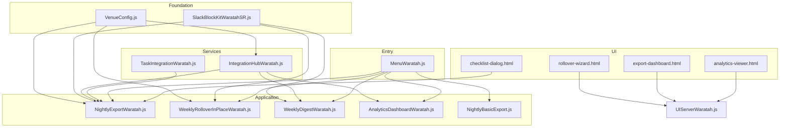
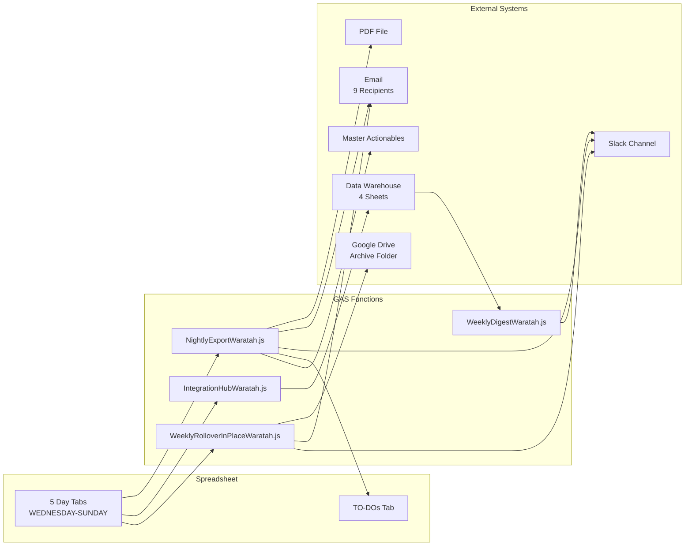

**Last updated:** May 17, 2026 (Phase 1.2 — cell map correction)
**Audience:** Managers who want to understand the complete system, or anyone receiving a technical handover
**Prerequisite:** Read 01-BASIC and 02-INTERMEDIATE first — this guide assumes you understand the daily workflow and system components

---

## IMPORTANT: May 17, 2026 System Cutover

> The Waratah shift report system was migrated to a new spreadsheet and new Apps Script project on May 17, 2026. This section documents the new system. The old system is dormant but archived for reference.

**Old system (dormant):**
- Spreadsheet: (redacted — archive only)
- Apps Script: `1hVHqRKw772uODidsOVxl9S1h6oqOWvxqevFFVFv6p6HNGl_-CO7PrVjz` (archived — triggers deleted)

**New system (LIVE):**
- Spreadsheet: `1rcfHTtey_HXC291FAmjpquYkRjWNGbFtClz2szKXfkA`
- Apps Script: `1YATiIFCp6zOM4xGscZOodacGhfxyPr3nvepnJ0SrJ7e5P73HrBFbqnqH`

**Triggers status (May 17–May 18):** Triggers are scheduled for creation on May 18, 2026 — Mon 9pm rollover, Mon 4pm Weekly Revenue Digest, Wed–Sun nightly exports. Until then, all exports must be manually triggered via the Admin Tools menu.

---

# Complete Backend Reference

This document describes every code file, every function, every automated trigger, and every data connection in the Waratah shift report system. It explains what each piece does and how they work together.

---

## File Inventory

The system consists of 16 JavaScript files and 4 HTML files. Together they contain approximately 6,200 lines of code.

### Core Files (Used Every Day)

| File | Lines | What It Does |
|------|-------|-------------|
| **NightlyExportWaratah.js** | 1,016 | The main daily workflow. PDF generation, email distribution, Slack posting, TO-DO aggregation, task push to Master Actionables, weekly TO-DO summary. |
| **IntegrationHubWaratah.js** | 1,064 | Data warehouse orchestrator. Reads shift data from the spreadsheet, validates it, writes to 4 warehouse sheets with duplicate prevention, maintains an audit log. |
| **WeeklyRolloverInPlaceWaratah.js** | 965 | Weekly rollover. Archives the week (PDF + spreadsheet copy), clears all data, updates dates to next week, sends notifications. |
| **MenuWaratah.js** | 156 | Builds the "Waratah Tools" menu when the spreadsheet opens. Password-gates all admin functions. |
| **VenueConfig.js** | 276 | Central configuration. Defines which cells to read for each data field, operating days, sheet names. Every other file depends on this. |
| **SlackBlockKitWaratahSR.js** | 159 | Builds formatted Slack messages. Provides 7 block-type functions (header, section, fields, divider, context, buttons, list) plus a posting function. |

### Supporting Files

| File | Lines | What It Does |
|------|-------|-------------|
| **WeeklyDigestWaratah.js** | 202 | Posts the weekly revenue comparison to Slack (this week vs last week). |
| **AnalyticsDashboardWaratah.js** | 517 | Builds formula-driven dashboards (Financial + Executive) in the data warehouse spreadsheet. |
| **NightlyBasicExport.js** | 261 | Standalone simplified export. Self-contained with its own configuration. Designed as a fallback if the main export breaks. |
| **UIServerWaratah.js** | 308 | Bridge between HTML dialogs and server-side functions. Serves the rollover wizard, export dashboard, and analytics viewer. |
| **TaskIntegrationWaratah.js** | 59 | Configuration constants for the Master Actionables push (column positions, spreadsheet ID). |
| **DiagnoseSlack.js** | 170 | Diagnostic tools for testing Slack webhooks and viewing system configuration. |

### Setup and Test Files

| File | Lines | What It Does |
|------|-------|-------------|
| **SetupWaratah.js** | 156 | Named range setup and verification for new sheet. Creates 177 named ranges from a config map. Provides verify diagnostic. Used during deployment and after layout changes. |
| **_SETUP_ScriptProperties.js** | 222 | One-time setup script that creates all 20 configuration properties. Contains webhook secrets — excluded from version control. |
| **TEST_DataExtractionVerification.js** | 332 | Verifies that IntegrationHub reads the correct cells. Compares extracted data against manual cell reads. |
| **TEST_VenueConfig.js** | 212 | Test suite for the venue configuration system. |
| **TEST_SlackBlockKitLibrary.js** | 103 | Tests the Slack message builder functions. |

### HTML Dialog Files

| File | What It Does |
|------|-------------|
| **checklist-dialog.html** | The pre-send checklist (Deputy timesheets + fruit order). Disables the Send button until both are confirmed. |
| **rollover-wizard.html** | Visual interface for previewing and running the weekly rollover. |
| **export-dashboard.html** | Dashboard showing export status for each day this week. |
| **analytics-viewer.html** | Visual interface for viewing warehouse analytics. |

---

## How the Files Depend on Each Other

The files form a layered architecture. Lower-level files provide services that higher-level files consume.

**Foundation layer (no dependencies):**
- **VenueConfig.js** — Every file that reads cell data depends on this
- **SlackBlockKitWaratahSR.js** — Every file that posts to Slack depends on this

**Service layer (depends on foundation):**
- **IntegrationHubWaratah.js** — Uses VenueConfig for cell references
- **TaskIntegrationWaratah.js** — Provides task push configuration

**Application layer (depends on foundation + services):**
- **NightlyExportWaratah.js** — Uses VenueConfig, SlackBlockKit, IntegrationHub, TaskIntegration
- **WeeklyRolloverInPlaceWaratah.js** — Uses VenueConfig, SlackBlockKit
- **WeeklyDigestWaratah.js** — Uses IntegrationHub (for warehouse ID), SlackBlockKit
- **AnalyticsDashboardWaratah.js** — Uses IntegrationHub (for warehouse ID)

**Entry point:**
- **MenuWaratah.js** — Calls functions from all application-layer files via menu items

**UI layer:**
- **checklist-dialog.html** — Calls `continueExport()` in NightlyExportWaratah.js
- **rollover-wizard.html** — Calls functions in UIServerWaratah.js
- **export-dashboard.html** — Calls functions in UIServerWaratah.js
- **analytics-viewer.html** — Calls functions in UIServerWaratah.js



---

## Function Reference

Every function that the system exposes (callable from menus, triggers, or HTML dialogs).

### NightlyExportWaratah.js — Daily Export Functions

| Function | How It's Called | What It Does |
|----------|----------------|-------------|
| `exportAndEmailPDF()` | Menu: Daily Reports > Export & Email PDF (LIVE) | Validates the active sheet, shows confirmation, opens the checklist dialog. |
| `exportAndEmailPDF_TestToSelf()` | Menu: Daily Reports > Export & Email (TEST to me) | Same as above but routes to test email/Slack. |
| `continueExport(sheetName, isTest)` | Called from checklist-dialog.html when both boxes are ticked | Runs the full 9-step pipeline: warehouse logging, TO-DO aggregation, Slack, task push, PDF, email, warnings. |
| `postToSlackFromSheet(...)` | Called from continueExport | Builds and posts the Block Kit message to Slack. |
| `pushTodosToMasterActionables(...)` | Called from continueExport | Copies tasks to the Master Actionables spreadsheet with deduplication. |
| `buildTodoAggregationSheet_(...)` | Called from continueExport | Rebuilds the TO-DOs summary tab from all 5 day sheets. |
| `generatePdfForSheet_NoUI_(...)` | Called from continueExport | Creates a PDF blob of the active sheet using Google's export URL. |
| `sendWeeklyTodoSummary_WARATAH()` | Menu: Admin > Weekly Reports > Weekly To-Do Summary (LIVE) | Compiles all week's tasks and posts a summary to Slack. |
| `backfillAllDaysTodos()` | Menu: Admin > Setup > Backfill TO-DOs (All Days) | Pushes all 5 days' tasks to Master Actionables at once. |

### IntegrationHubWaratah.js — Data Warehouse Functions

| Function | How It's Called | What It Does |
|----------|----------------|-------------|
| `runIntegrations(sheetName)` | Called from continueExport | Main entry point. Extracts data, validates, logs to warehouse, writes audit trail. |
| `extractShiftData_(sheetName, config)` | Called from runIntegrations | Reads approximately 30 cells from the specified sheet and returns a structured data object. |
| `logToDataWarehouse_(shiftData, config)` | Called from runIntegrations | Writes to 4 warehouse sheets (NIGHTLY_FINANCIAL, OPERATIONAL_EVENTS, WASTAGE_COMPS, QUALITATIVE_LOG) with duplicate checking. |
| `validateShiftData_(shiftData)` | Called from runIntegrations | Checks that required fields (date, MOD, revenue) are present and valid. |
| `showIntegrationLogStats()` | Menu: Admin > Data Warehouse > Show Integration Log | Displays a summary of all warehouse writes. |
| `backfillShiftToWarehouse()` | Menu: Admin > Data Warehouse > Backfill Current Sheet | Manually pushes the active sheet's data to the warehouse. |
| `runWeeklyBackfill_()` | Automatic trigger: Monday 8am | Scans all 5 sheets and logs any that weren't already in the warehouse. |
| `runValidationReport()` | Run from Apps Script editor | Health check: validates all connections and data extraction. |

### WeeklyRolloverInPlaceWaratah.js — Rollover Functions

| Function | How It's Called | What It Does |
|----------|----------------|-------------|
| `performWeeklyRollover()` | Automatic trigger: Monday 10am + Menu (password required) | Full rollover: validate, summarise, archive PDF, archive spreadsheet, clear data, update dates, notify. |
| `previewRollover()` | Menu: Admin > Weekly Rollover > Preview (Dry Run) | Shows what the rollover would do without executing. |
| `createWeeklyRolloverTrigger()` | Menu: Admin > Weekly Rollover > Create Trigger | Installs the Monday 10am timer. Removes any existing trigger first. |
| `removeWeeklyRolloverTrigger()` | Menu: Admin > Weekly Rollover > Remove Trigger | Removes the Monday timer. |
| `fixSheetNamesAndDateFormat()` | Menu: Admin > Setup > Fix Tab Names | Repairs tab names and date formatting if they've been accidentally changed. |

### WeeklyDigestWaratah.js — Revenue Digest Functions

| Function | How It's Called | What It Does |
|----------|----------------|-------------|
| `sendWeeklyRevenueDigest_Waratah()` | Automatic trigger: Monday 9am + Menu (password required) | Reads warehouse data, compares this week vs last week, posts to Slack. |
| `setupWeeklyDigestTrigger_Waratah()` | Menu: Admin > Weekly Digest > Setup Trigger | Installs the Monday 9am timer. |

### SetupWaratah.js — Named Range Management

| Function | How It's Called | What It Does |
|----------|----------------|-------------|
| `setupWaratahNamedRanges_()` | Menu: Admin > Named Ranges > Setup All Named Ranges | Idempotent. Creates or updates all 177 named ranges from a config map. Logs created/skipped/errors. |
| `verifyWaratahNamedRanges_()` | Menu: Admin > Named Ranges > Verify Named Ranges | Diagnostic. Lists missing ranges, mis-targeted ranges, and unexpected leftover ranges. Output via Logger and UI alert. |

### MenuWaratah.js — Menu and Access Control

| Function | How It's Called | What It Does |
|----------|----------------|-------------|
| `onOpen()` | Automatic: when the spreadsheet opens | Builds the entire "Waratah Tools" menu. Runs every time any user opens the spreadsheet. |
| `requirePassword_()` | Called before any admin function | Prompts for the admin password. Blocks execution if incorrect. |

### AnalyticsDashboardWaratah.js — Dashboard Builder

| Function | How It's Called | What It Does |
|----------|----------------|-------------|
| `buildFinancialDashboard()` | Menu: Admin > Analytics > Build Financial Dashboard | Creates a QUERY/SUMIFS-based financial dashboard in the warehouse. |
| `buildExecutiveDashboard()` | Menu: Admin > Analytics > Build Executive Dashboard | Creates an executive summary dashboard in the warehouse. |

### NightlyBasicExport.js — Fallback Export

| Function | How It's Called | What It Does |
|----------|----------------|-------------|
| `sendShiftReportBasic()` | Menu: Daily Reports > Send Basic Report | Self-contained export: validates, generates PDF, emails, posts plain-text Slack, copies TO-DOs. No warehouse logging, no task push. |

### AIInsightsWaratah.js — AI-Powered Shift Summarization

| Function | How It's Called | What It Does |
|----------|----------------|-------------|
| `generateShiftSummary_Waratah(shiftData)` | Called from NightlyExportWaratah during Slack message building | Sends shift data to Claude API to generate a concise 2-3 sentence AI summary. Requires `ANTHROPIC_API_KEY` in Script Properties. Returns null if API key not set or if API call fails (non-blocking — export continues). |
| `callClaudeApi_(systemPrompt, userPrompt, apiKey)` | Called from generateShiftSummary_Waratah | Helper function that handles the UrlFetchApp call to Claude API. Manages request formatting, response parsing, and error logging. |

**Distribution:** Output is routed based on `AI_INSIGHTS_MODE` property. In `evan_only` mode (default), the AI summary goes to Evan only; other recipients see a generic summary. In `live` mode, the AI summary replaces the generic summary for all recipients.

**Data sent to Claude:** Shift date, MOD name, financial totals (revenue, tips), and all narrative fields (summary, VIP notes, good, bad, kitchen notes). Narratives are truncated to 300 chars each to stay under token limits.

---

## Named Range System (May 17, 2026)

> The new system uses 177 named ranges to manage cell access. This replaces hardcoded cell addresses and provides a flexible, self-documenting reference layer. Named ranges follow the convention: `DAY_SR_FieldName` (e.g., `WEDNESDAY_SR_NetRevenue`, `FRIDAY_SR_CashVariance`).

This means:
- Code never references a cell directly (e.g., never `sheet.getRange('B34')`)
- Every field is defined in a configuration table with its named range
- If the layout changes, only the named range definition updates — code stays the same
- The system auto-verifies named ranges exist on every deployment

The full list of 177 named ranges is maintained in `docs/waratah/CELL_REFERENCE_MAP.md`. Examples:
- `WEDNESDAY_SR_Date` — the date cell for Wednesday's shift report
- `THURSDAY_SR_NetRevenue` — Thursday's net revenue cell
- `FRIDAY_SR_CashCounted` — Friday's total cash counted (new)

**For technical staff:** Use `getFieldValue(sheet, 'fieldName')` helper functions. Never use raw `getRangeByName()` calls.

---

## Cell Layout (Phase 1.2 — 36 Fields, 180 Named Ranges)

<!-- Added 2026-05-17 (FIELD_CONFIG rewrite): Updated cell layout to match new field system. All cells accessed via named ranges (e.g. WEDNESDAY_SR_NetRevenue); hardcoded addresses listed for reference/fallback. -->

> Every shift report tab (WEDNESDAY–SUNDAY) has the same layout. All cells are accessed via named ranges like `WEDNESDAY_SR_NetRevenue`, `THURSDAY_SR_CashTakings`, etc. The 180 total named ranges (36 fields × 5 days) are auto-created by `setupWaratahNamedRanges_()`. Hardcoded cell addresses below are fallback references only.

### Header (rows 3–7)

| Cell(s) | Field | Type | Warehouse Column |
|---------|-------|------|-----------------|
| B3:F3 | Date | Merged, pre-filled by rollover | A |
| B4 | MOD | Single cell, manual entry | D |
| B6 | FOH Staff | Single cell, manual entry | E |
| B7 | BOH Staff | Single cell, manual entry | F |

### Cash Reconciliation (rows 10–26)

| Cells | Field | Type | Formula? | Warehouse Column |
|-------|-------|------|----------|-----------------|
| C10:C17 | Public Till Count | Data entry (8 rows) | No | Included in G |
| D10:D17 | Public Till Refloat | Data entry (8 rows) | No | Not warehoused |
| E10:E17 | Terrace Till Count | Data entry (8 rows) | No | Included in G |
| F10:F17 | Terrace Till Refloat | Data entry (8 rows) | No | Not warehoused |
| C18 | Cash Counted | **FORMULA — DO NOT CLEAR** | **Yes** | G |
| C19 | Cash Takings | **FORMULA — DO NOT CLEAR** | **Yes** | H |
| C22 | Cash Returns | Manual entry | No | S |
| C23 | CD Discount | Manual entry | No | T |
| C24 | Cash Recorded | **FORMULA — DO NOT CLEAR** | **Yes** | Not warehoused |
| C26 | 💰 Cash Variance | **FORMULA — DO NOT CLEAR** | **Yes** | I |

### Tips (rows 29–32)

| Cell | Field | Type | Formula? | Warehouse Column |
|------|-------|------|----------|-----------------|
| C29 | Cash Tips | Manual entry | No | J |
| C30 | Card Tips | Manual entry | No | K |
| C31 | Surcharge Tips | Manual entry | No | L |
| C32 | Total Tips | **FORMULA — DO NOT CLEAR** | **Yes** | M |

### Revenue & Expenses (rows 37–54)

| Cells | Field | Type | Formula? | Warehouse Column |
|-------|-------|------|----------|-----------------|
| B37 | Production Amount | Manual entry | No | N |
| B38 | Function Deposit | Manual entry | No | O |
| B40:B45 | Card Expenses | Manual entry (6 rows) | No | Derived into Q |
| B47 | Cash Take Display | **FORMULA — DO NOT CLEAR** | **Yes** | Not warehoused |
| B48 | Gross Sales | **FORMULA — DO NOT CLEAR** | **Yes** | Not warehoused |
| B50 | Total Adjustments | Manual entry | No | P |
| B51 | Discounts Exc Cash | **FORMULA — DO NOT CLEAR** | **Yes** | Not warehoused |
| B52 | Gross Sales Less Disc | **FORMULA — DO NOT CLEAR** | **Yes** | Not warehoused |
| B53 | Taxes | **FORMULA — DO NOT CLEAR** | **Yes** | R |
| B54 | Net Revenue | **FORMULA — DO NOT CLEAR** | **Yes** | Q |
| D37:D54 | Running Totals | **FORMULA — DO NOT CLEAR** | **Yes** | Not warehoused |

### Narrative (rows 59–90, merged A:F)

| Cell(s) | Field | Type | Warehouse Sheet |
|---------|-------|------|-----------------|
| A59:F59 | General Shift Comments | Merged, manual entry | QUALITATIVE_NOTES |
| A61:F61 | Guests of Note | Merged, manual entry | QUALITATIVE_NOTES |
| A63:F63 | The Good | Merged, manual entry | QUALITATIVE_NOTES |
| A65:F65 | The Bad | Merged, manual entry | QUALITATIVE_NOTES |
| A67:F67 | Kitchen Notes | Merged, manual entry | QUALITATIVE_NOTES |

### Tasks (rows 69–84)

| Cell(s) | Field | Type | Destination |
|---------|-------|------|-------------|
| A69:A84 | TO-DO Tasks | 16 rows, merged A:E per row, manual entry | OPERATIONAL_EVENTS + Master Actionables |
| D69:D84 | TO-DO Assignees | 16 rows, single cell per row, staff name | OPERATIONAL_EVENTS + Master Actionables |

### Incidents (rows 86–90, merged A:F)

| Cell(s) | Field | Type | Warehouse Sheet(s) |
|---------|-------|------|-------------------|
| A86:F86 | Wastage/Comps | Merged, manual entry | WASTAGE_COMPS |
| A88:F88 | Maintenance Issues | Merged, manual entry (NEW) | QUALITATIVE_NOTES |
| A90:F90 | RSA / Injuries | Merged, manual entry | QUALITATIVE_NOTES |

---

## Automated Triggers

> **TRIGGERS PENDING CREATION** — As of May 17, 2026, no time-based triggers are installed on the new Apps Script project. All exports must be manually triggered until setup completes on May 18, 2026. The schedule and function names below show the planned configuration.

Three time-based triggers will run the automated components once created. These are set up once and run indefinitely until removed.

| Trigger | Schedule | Function | File | Status |
|---------|----------|----------|------|--------|
| Weekly Rollover | Monday 9:00pm AEST | `performWeeklyRollover()` | WeeklyRolloverInPlaceWaratah.js | PENDING |
| Weekly Revenue Digest | Monday 4:00pm AEST | `sendWeeklyRevenueDigest_Waratah()` | WeeklyDigestWaratah.js | PENDING |
| Weekly Backfill | Monday 8:00am AEST | `runWeeklyBackfill_()` | IntegrationHubWaratah.js | PENDING |

Plus one event trigger:

| Trigger | Event | Function | File |
|---------|-------|----------|------|
| Menu creation | Spreadsheet opened | `onOpen()` | MenuWaratah.js |

**To check if triggers are active:** Extensions > Apps Script > Triggers (clock icon on the left sidebar).

**To recreate a trigger:** Use the corresponding setup function from the Admin menu, or run it from the Apps Script editor.

---

## Script Properties (System Configuration)

The system stores 18 configuration values as Google Apps Script "Script Properties" — key-value pairs that are accessible to all code in the project but not visible in the spreadsheet.

| Property | What It Controls |
|----------|-----------------|
| `VENUE_NAME` | Set to "WARATAH" — used to load the correct cell configuration |
| `MENU_PASSWORD` | Password required for admin menu functions |
| `WARATAH_SLACK_WEBHOOK_LIVE` | Slack webhook URL for the live Waratah channel |
| `WARATAH_SLACK_WEBHOOK_TEST` | Slack webhook URL for the test channel |
| `WARATAH_EMAIL_RECIPIENTS` | JSON object mapping email → name, containing 9 recipients for report distribution |
| `WARATAH_SHIFT_REPORT_CURRENT_ID` | Google Sheets ID of the current shift report spreadsheet |
| `WARATAH_WORKING_FILE_ID` | Same as above — used by rollover for validation |
| `WARATAH_DATA_WAREHOUSE_ID` | Google Sheets ID of the data warehouse |
| `WARATAH_TASK_MANAGEMENT_ID` | Google Sheets ID of the task management spreadsheet |
| `TASK_MANAGEMENT_SPREADSHEET_ID` | Same as above — used by TaskIntegrationWaratah.js |
| `ARCHIVE_ROOT_FOLDER_ID` | Google Drive folder ID where archives are saved |
| `WARATAH_CASH_RECON_FOLDER_ID` | Reserved for future cash reconciliation feature |
| `SLACK_MANAGERS_CHANNEL_WEBHOOK` | Managers-only Slack channel webhook |
| `INTEGRATION_ALERT_EMAIL_PRIMARY` | Email address for system error alerts |
| `INTEGRATION_ALERT_EMAIL_SECONDARY` | Backup email for error alerts |
| `ESCALATION_EMAIL` | Email for task escalation notifications |
| `ESCALATION_SLACK_WEBHOOK` | Slack webhook for task escalation |
| `SLACK_DM_WEBHOOKS` | JSON object mapping staff names to personal Slack webhooks |

**These are set once during initial setup** using `_SETUP_ScriptProperties.js` (which is excluded from version control because it contains webhook secrets). They rarely need to change. If someone new joins the email distribution list, the `WARATAH_EMAIL_RECIPIENTS` property needs to be updated in the Apps Script editor (File > Project Settings > Script Properties).

---

## Data Flow Diagram

This shows how data moves from the spreadsheet through the system to external destinations.



---

## Deployment Workflow

> The Waratah code is version-controlled on `waratah/develop` branch. Deployment uses `clasp push` (not `git push`). Understanding the two-project setup and branch model matters.

**Git Branch Model:**
- `main` — stable, merged code only
- `waratah/develop` — ongoing Waratah development
- `sakura/develop` — Sakura development (separate but shares documentation files)

**Two-Project Trap (Critical):**
- `.clasp.json` in THE WARATAH/ directory contains the Apps Script project ID
- This ID must point to the **LIVE** project (`1YATiIFCp6zOM4xGscZOodacGhfxyPr3nvepnJ0SrJ7e5P73HrBFbqnqH`) after the May 17 cutover
- Pushing with the wrong `.clasp.json` deploys code to the old (dormant) project — no visible error, but code goes nowhere
- After any `.clasp.json` change, always verify: `clasp status` should show the correct Script ID

**Standard Deployment Order:**
1. Code changes → edit `.js` files in THE WARATAH/SHIFT REPORT SCRIPTS/
2. Documentation updates → edit `.md` files in docs/waratah/explainers/ and CLAUDE_WARATAH.md
3. `clasp push` → deploys code from THE WARATAH/ to the LIVE project
4. `git commit` + `git push` (optional) → saves to GitHub for version history (does NOT affect production)

**Cross-Merge Rule (Mandatory):**
If your commit touches shared files (docs/, CLAUDE_*.md), immediately cross-merge to the other venue branch:
```bash
git checkout sakura/develop && git merge waratah/develop && git checkout waratah/develop
```

---

## Error Handling Philosophy

The system is designed to be **non-destructive and fault-tolerant:**

- Every step in the nightly export pipeline is wrapped in error handling. If the Slack notification fails, the email still sends. If the warehouse logging fails, the PDF still generates. No single failure stops the entire pipeline.

- When any step fails, a warning notification is sent to Evan via Slack with details of what went wrong. The manager who clicked Send sees a success message because the core delivery (PDF + email) completed.

- The weekly rollover uses a **lock** to prevent two copies from running at the same time (for example, if someone manually triggers it while the automatic timer is also running). The second instance waits up to 30 seconds for the first to finish, then gives up.

- All warehouse writes use **duplicate prevention**. The system checks if today's data has already been logged before writing. This means re-running the export or backfill is always safe — it won't create duplicate rows.

---

## Rollover Safety Design

> The weekly rollover is designed for idempotency and safety. Running it twice won't double-clear or corrupt data.

**Idempotency:**
- Running the rollover twice in the same week is a no-op (detects by comparing tab dates to expected dates)
- Safe to re-run if the automatic trigger misfires

**Dry-Run Mode:**
- `runWaratahWeeklyRollover({ dryRun: true })` logs intended changes without executing them
- Use this to preview what will happen before running manually

**Lock Acquisition:**
- `LockService.getScriptLock()` prevents concurrent runs (30-second timeout)
- If the automatic trigger fires while a manual run is in progress, the second waits for the first to finish

**Cell-Clear Whitelist:**
- Only clears manager-input cells (till counts, refloats, narrative fields, todos, financial entries)
- Formula cells (`C18`, `C19`, `C26`, `B36`, `B38`, `B39`) explicitly excluded — they are never cleared
- **Never uses `sheet.clear()`** (which destroys formatting) — uses `range.clearContent()` on specific ranges

**Day-Prefix Matching:**
- Finds tabs by case-insensitive day name match (handles minor typos in tab names)
- Renames all 7 tabs (Mon–Sun) for visual consistency; only Wed–Sun are cleared

**Australian Timezone Explicit:**
- Date computation uses `Session.getScriptTimeZone()` which returns `'Australia/Sydney'`
- Ensures dates are calculated in the venue's timezone, not the script executor's timezone

**Post-Rollover Verification:**
- After successful rollover, calls `verifyWaratahNamedRanges_()` and fails loud if any named ranges are missing
- Prevents silent degradation from accidental layout corruption

---

## Key Technical Rules

These are the system constraints that matter when anyone is maintaining or troubleshooting the system.

### Formula Cells Must Never Be Cleared

Cells B15, B16, B26, B27, B28, B29, B36, B38, and B39 contain formulas. They are deliberately excluded from the rollover's clear operation. If a formula is accidentally deleted, it must be restored from an archived copy.

### Merged Cells Require Full-Range References

Narrative cells (A43, A45, A47, A49, A51) and task cells (A53:E53 through A61:E61) are merged across columns A through F. The value lives in column A. Trying to clear or read from columns B-F of a merged range does nothing — you must reference the full range starting from column A.

### The Password System

All admin menu items are wrapped in password check functions. The password is stored in the `MENU_PASSWORD` Script Property. If someone enters the wrong password, the function stops immediately. The password is the same for all admin functions.

### UI Functions in Trigger Context

Some functions can run both from a menu click (interactive) and from an automatic trigger (non-interactive). When running from a trigger, any attempt to show a dialog or alert will fail. All such calls are wrapped in error handling so the function continues silently when running from a trigger.

---

## Warehouse Schema Detail

### NIGHTLY_FINANCIAL (25 columns, A through Y — expanded May 17, 2026)

| Column | Header | Source |
|--------|--------|--------|
| A | Date | B3 (parsed) |
| B | Day | Calculated (day name) |
| C | WeekEnding | Calculated (next Sunday) |
| D | MOD | B4 |
| E | Staff | B5 |
| F | NetRevenue | B34 |
| G | ProductionAmount | B8 |
| H | CashTakings | B15 |
| I | GrossSalesIncCash | B16 |
| J | CashReturns | B17 |
| K | CDDiscount | B19 |
| L | Refunds | B21 |
| M | CDRedeem | B23 |
| N | TotalDiscount | B25 |
| O | DiscountsCompsExcCD | B26 |
| P | GrossTaxableSales | B27 |
| Q | Taxes | B28 |
| R | NetSalesWTips | B29 |
| S | CardTips | B32 |
| T | CashTips | B33 |
| U | TotalTips | B36 |
| V | CashCounted | C18 (NEW — May 17) |
| W | ExpectedCash | C24 (NEW — May 17) |
| X | CashVariance | C26 (NEW — May 17) |
| Y | LoggedAt | Timestamp |

### OPERATIONAL_EVENTS (8 columns)

| Column | Header |
|--------|--------|
| A | Date |
| B | Day |
| C | MOD |
| D | TaskDescription |
| E | AssignedTo |
| F | SheetName |
| G | WeekEnding |
| H | LoggedAt |

### WASTAGE_COMPS (6 columns)

| Column | Header |
|--------|--------|
| A | Date |
| B | Day |
| C | MOD |
| D | WastageNotes |
| E | WeekEnding |
| F | LoggedAt |

### QUALITATIVE_LOG (11 columns)

| Column | Header |
|--------|--------|
| A | Date |
| B | Day |
| C | MOD |
| D | ShiftSummary |
| E | VIPNotes |
| F | TheGood |
| G | TheBad |
| H | KitchenNotes |
| I | WastageNotes |
| J | RSAIncidents |
| K | LoggedAt |

---

## Slack Block Kit Message Structure

> The Slack posts for shift reports use Block Kit formatting — a structured JSON layout that makes messages readable and actionable.

**Block Sequence (in order):**
1. **Header block** — date, day of week, and "Shift Report Summary" title
2. **Context block** — MOD name, staff list, timestamps
3. **Financial section block** — Net Revenue, Card Tips, Cash Tips, Total Tips (in a 2-column layout), plus the new **Cash Variance: $X.XX** line showing if the till balanced
4. **Divider** — visual separator
5. **Narrative section block** — Shift Summary, VIP Notes, The Good, The Bad, Kitchen Notes (5 fields)
6. **Divider** — visual separator
7. **Tasks section block** — list of tasks with assignees (if any tasks were entered)
8. **Wastage & RSA block** — wastage notes and RSA incidents (if any)
9. **Action buttons** — "View PDF in Drive" and "Open Shift Report Sheet" buttons
10. **Footer context** — logged timestamp

**Character Limits:**
- Slack section blocks have a 3000-character limit per section
- Long narratives (especially "The Bad" field) can exceed this limit
- `truncateForSlack_()` helper function truncates narrative fields to fit within limits (typically 400–500 chars per field)
- If truncation occurs, "..." is appended to indicate more content

**Webhook Configuration:**
- LIVE Slack post: `WARATAH_SLACK_WEBHOOK_LIVE` Script Property
- TEST Slack post: `WARATAH_SLACK_WEBHOOK_TEST` Script Property
- Both are Incoming Webhook URLs configured in Slack workspace settings

---

## Archive Folder Structure

When the weekly rollover runs, it saves files in this structure on Google Drive:

```
Archive/
  2026/
    2026-02/
      pdfs/
        Waratah_Shift_Report_WE_02.03.2026.pdf
      sheets/
        Waratah_Shift_Report_WE_02.03.2026  (full spreadsheet copy)
    2026-03/
      pdfs/
        Waratah_Shift_Report_WE_09.03.2026.pdf
      sheets/
        Waratah_Shift_Report_WE_09.03.2026
```

Folders are created automatically if they don't exist. The naming convention uses the Week Ending date (always a Sunday).
